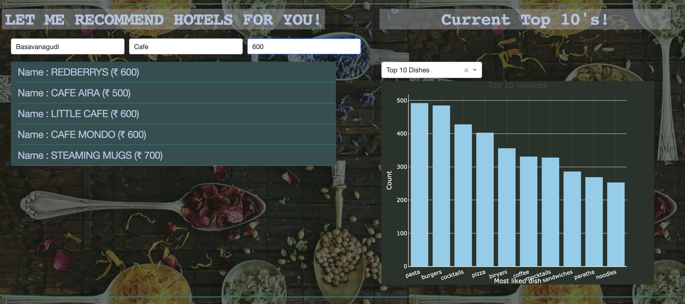
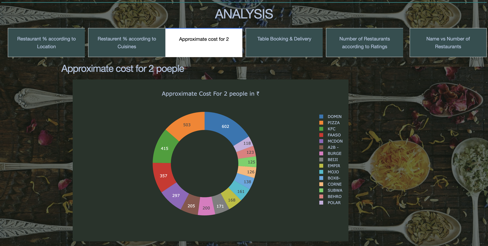
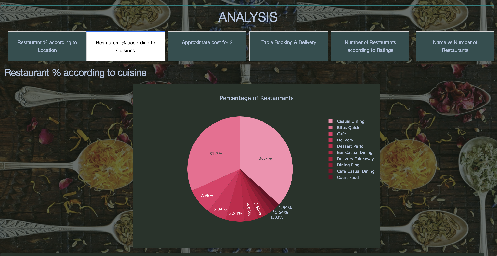
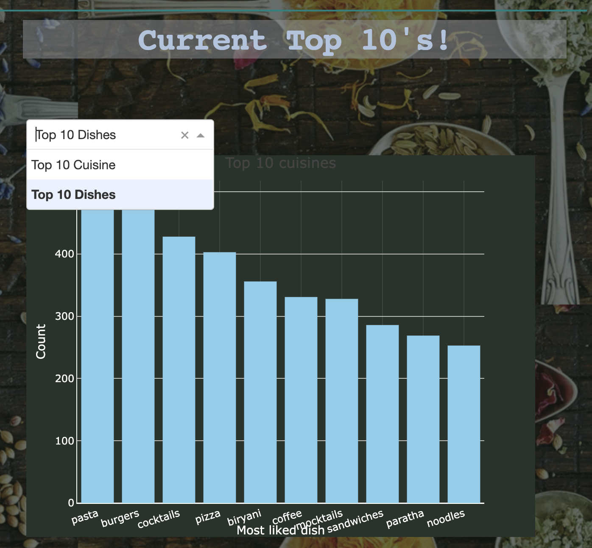

# **Foodopia: Restaurant Ratings Prediction for Wise Investments**

Restaurant Recommendation

**Food for your Mood**

**Foodopia** is a data-driven application that predicts restaurrant ratings based on various input parameters, helping restaurrant owners make informed investment decisions. The app uses advanced machine learning models to generate accurate predictions, allowing owners to understand potential performance before investing in restaurrant improvements or new ventures. It also has a recommendation systems to recomemend Restaurants near you to enjoy the food according to your prefrences.

---

## **Table of Contents**
- [Introduction](#introduction)
- [Features](#features)
- [Technical Overview](#technical-overview)
- [Business Impact](#business-impact)
- [Machine Learning Workflow](#machine-learning-workflow)
  - [Data Preprocessing](#data-preprocessing)
  - [Exploratory Data Analysis (EDA)](#exploratory-data-analysis-eda)
  - [Modeling](#modeling)
- [Dash Web Application](#dash-web-application)
- [Installation and Usage](#installation-and-usage)
- [Conclusion](#conclusion)


---

## **Introduction**

Foodopia is designed to assist hotel and restaurant owners in making data-driven decisions about investments. By analyzing various factors such as location, cuisine type, and average prices, the application predicts restaurrant ratings, giving owners insights into their potential success. Foodopia also recommends restaurants to users according to their preferences of location, type of restaurant, cuisine, distance and more.

This README provides an overview of the technical stack, machine learning models, and business impact of the project.

---

## **Features**

- Predict restaurrant ratings based on various input factors (e.g., location, cuisine, restaurant type, etc.).
- Interactive web app to allow owners to explore predictions.
- Recomemnd restaurants according to user preferences for type of restaurant, cuisine, ratings, reviews, location, distance and more.
- Models trained using real-world data and optimized for accuracy, precision, and minimal bias.
- Handles data anomalies, missing values, and performs string manipulation to clean the data.

---

## **Predictor**


## **Recommender**



## **Analysis**



## **Top 10s**



## **Technical Overview**

- **Programming Language**: Python
- **Libraries**: 
  - Data manipulation: Pandas, NumPy
  - Visualization: Matplotlib, Seaborn
  - Machine Learning: Scikit-learn
  - Web App Framework: Dash
- **Models Used**:
  - Linear Regression
  - Random Forest Regression

---

## **Business Impact**

Foodopia helps hotel owners:
- Understand how changes in factors like location, cuisine, and pricing affect ratings.
- Make informed investment decisions based on predicted ratings.
- Avoid costly investments by forecasting the impact of changes on customer satisfaction.
- Choose the location wisely and understand user demand for certain cuisines and locality.

---

## **Machine Learning Workflow**

### **1. Data Preprocessing**

- Dropped unnecessary columns to reduce noise in the data.
- Converted string values to uppercase for consistency in training.
- Handled missing values by identifying and imputing where necessary.
- Addressed data anomalies by converting them to `NaN` and imputing them with appropriate values.
- Removed duplicate entries for cleaner, more reliable data.

### **2. Exploratory Data Analysis (EDA)**

Performed EDA to uncover patterns, trends, and relationships within the dataset:
- Analyzed distributions, correlations, and outliers to gain insights.
- Visualized data using Matplotlib and Seaborn to identify key features influencing ratings.

### **3. Modeling**

- Implemented **Linear Regression** and **Random Forest Regression** models to predict hotel ratings.
- Performed hyperparameter tuning to optimize model performance.
- Ensured a balanced model with minimal bias, low error rates, and high accuracy for reliable predictions.

---

## **Dash Web Application**

The web application was developed using **Dash** to allow restaurant owners to interact with the prediction model. Users can input parameters such as:
- Location
- Type of cuisine
- Average price for two people
- Type of restaurant

The app provides real-time predictions and helps users make data-driven decisions.

---

## **Installation and Usage**

### **Prerequisites**
- Python 3.6+
- Required Libraries: Dash, Flask, Pandas, Scikit-learn, Matplotlib, Seaborn, NumPy

### **Steps to Run**
1. Clone the repository:
   ```bash
   git clone https://github.com/yourusername/Foodopia.git
